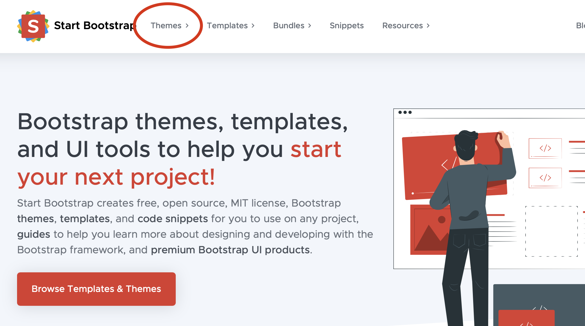

# Bootstrap Website
**Build your own professional portfolio and learn a little about designing quickly and efficiently with Bootstrap.**

##What is Bootstrap?

Bootstrap provides a uniform method for working with HTML and CSS. It uses a common style sheet and script that makes styling and adding functionality quick and easy.

##Directions

1. Go to the [Start Bootstrap Website](https://startbootstrap.com). Click on "**Themes**." Later, you might want to look for code snippets or other code ideas in templates.

2. Find a theme, click "**preview & download**."

3. Locate the file in your downloads, **unzip**, and move to a safe place on your computer.

4. Open /edit the **index.html** file with any text editor (brackets, Notepad++, VB, Atom, etc.)

5. This is where to edit the actual script – just replace all there filler with your content, comment
out sections, etc. Save when finished and double-click the index to preview in-browser. You
can even find/use/edit other bootstrap components you find elsewhere.

6. Load to your own server or start a new repository on GitHub, add files, and activate GitHub Pages.
