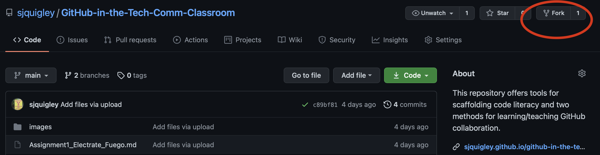
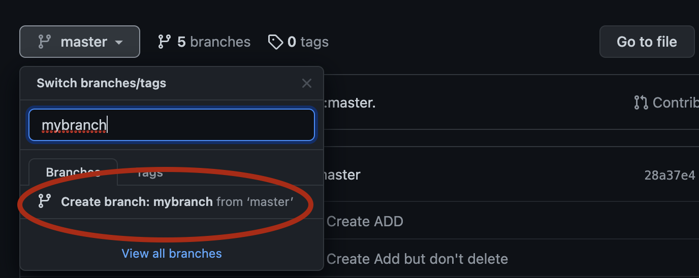
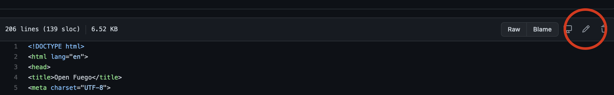
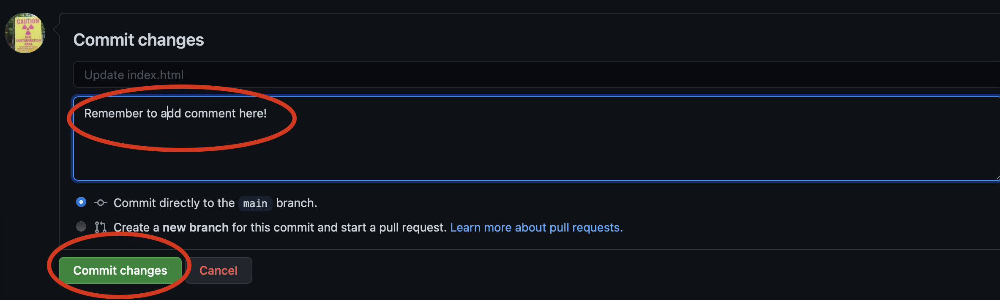
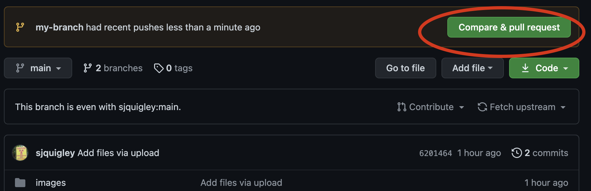
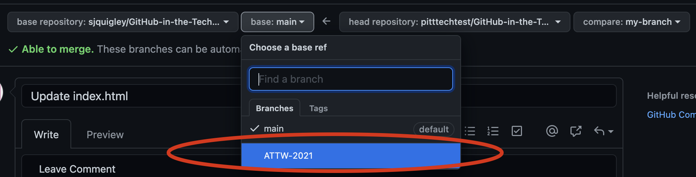
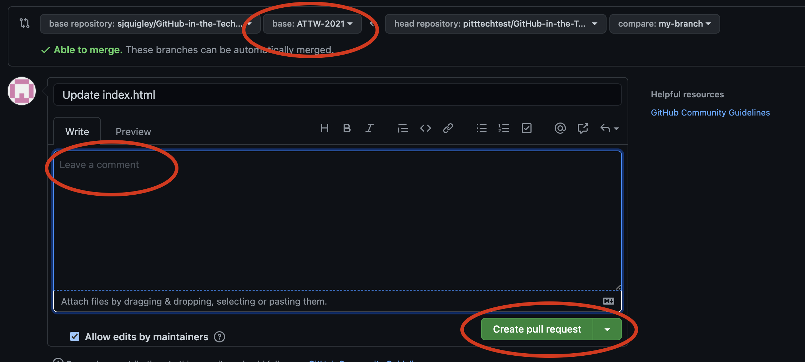
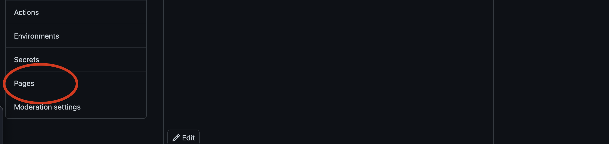
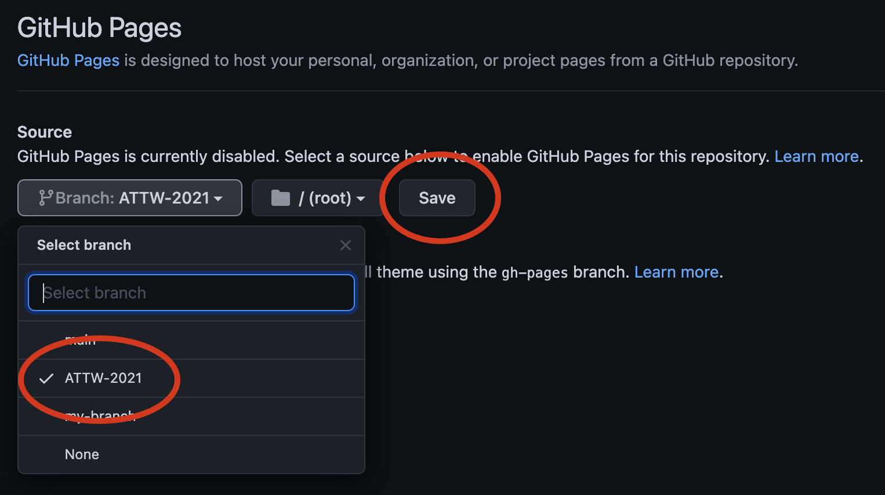

#Forked Collaboration  

Using Git to copy, edit, and compare files within the same server. In this lesson you will learn the basics of forked collaboration and from there, you can use these same methods to teach others. No...of course this isn't a pyramid scam!

Bennefits of this method...

* make your own downstream version of an open-source repository
* benefit from changes that may occur upstream
* collaborate with others you may not know...by simply making pull requests

Disadvantages

* repositories must be public to contribute
* projects will be inherently decentralized
* you may lack other tool affordances

##Directions

1. Fork our [GitHub Repository for the Tech Comm Classroom]().

2. If you don't have a GitHub account, you will be prompted to make one now. *Welcome to GitHub! Meow!*
3. Next, you'll create your own branch. Click on "**Master**," and in the fill line type "**mybranch**." To save, click just below on "**create branch:my branch** from 'master'."

*So far you used git via the GitHub website to fork a repositiry and create two different branches downstream. Pretty cool!*

Now let's make some edits to your branch.

4. In your branch, click on the index.html file. Click on the pen tool which will allow you to edit the file using GitHub's web text editor. 

Scroll through the code until we find the code narrative section. Delete my narrative and replace it with your own. Take a moment to share your own code narrative and what brought you to this workshop. 
5. Once you have finished editing, scroll down to the bottom of the page and click "**Commit**"

Now let's share your contribution with the base repository/ATTW 2021 branch you forked. 

6. To do so, we will need to make a **pull request** (Alternatively, you can select "**my branch**" and Click "**contribute**" and then "open pull request.")

7. Make sure you are contributing to the base repository/ATTW 2021 branch. 

8. Write a comment to let the base repository owner know what this pull request does. Then click "**create pull request**" Don't worry if there are conflicts.

9. If your pull request is approved, your edits will be **pushed** into the base master repository. Note that the upstream owner may request changes before pushing these changes.

10. Once your pull request is closed, you can may be alerted that your request was approved or that there are new changes upstream. Alternatively, you can click "fetch upstream" and Git will compare the changes in the two repositories. If there are changes, you can click "fetch and merge."

*So what just happened?* Well, you made a change to your own branch file and then used Git to suggest changes upstream to the master repository. Once that change was approved, you used Git again to merge changes from the upstream master to your downstream master. You now have an updated master and a your own protected version of this . *Git is pretty cool, right?*

At some point, you may want to "download" or "clone" files to your computer where you can work locally to edit files before committing them to your repository branch. 

So why do I have 2 branches? You have a branch from todays workshop (main) that should show your project contributions. And you have another version you can use to teach others how to use GitHub. **Ok...this *is* kind of like a pyramid scam.**

## GitHub Pages

1. Cool, let's get your version of this narrative out there on the internet! Go to "**settings**."

2. On the side bar, select "**Pages**."

3. Change the branch from Main to 'my branch.'
. Click "**save**.

4. Copy the URL GitHub has just given you. After a couple minutes, you will be able to access your website URL in any browser. In the repository about section, you can paste in your GitHub Pages URL.

Peace and love, Stephen Quigley, University of Pittsburgh
