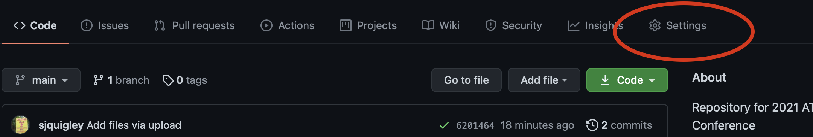
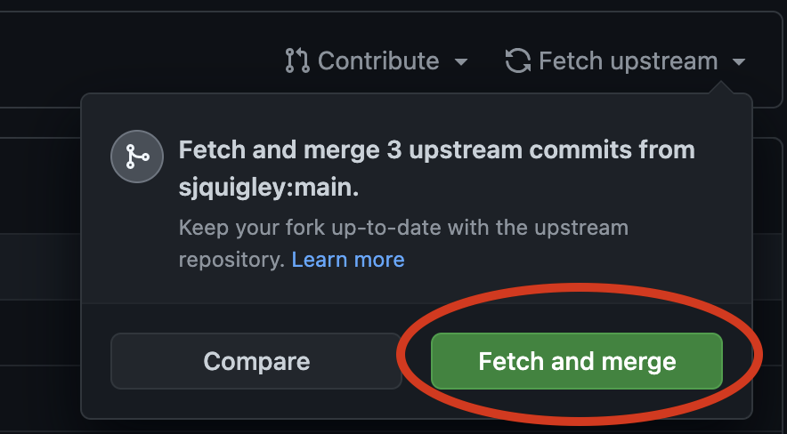

# InterRepository or Forked Collaboration  

Using Git to copy, edit, and compare files inside the GitHub server. In this lesson you will learn the basics of forked collaboration and from there, you can use these same methods to teach others. *Nooooo...this is not a pyramid scam!*

Benefits of this method...

* make your own downstream copy of an open-source repository
* benefit from changes that may occur upstream
* collaborate with others you may not know...by simply making pull requests

Disadvantages

* repositories must be public to contribute
* projects will be inherently decentralized
* you may lack other tool affordances

## Directions

1. Fork our [GitHub Repository for the Tech Comm Classroom](https://github.com/sjquigley/GitHub-in-the-Tech-Comm-Classroom).

2. If you don't have a GitHub account, you will be prompted to make one now. *Welcome to GitHub! Meow!*
3. Next, you'll create your own branch. Click on "**Master**," and in the fill line type "**mybranch**." To save, click just below on "**create branch:mybranch** from 'master'."

*So far you used git via the GitHub website to fork a repository and create a new branch downstream. Pretty cool!*

Now let's make some additions to your branch.

4. In "**mybranch**", click on the index.html file. Click on the pen tool which will allow you to edit the file using GitHub's web text editor. 

Scroll through the code until we find the code narrative section. Follow the directions in the code taking a moment to share your own code narrative and what brought you to this workshop.
 
5. Once you have finished editing, scroll down to the bottom of the page and click "**Commit**"

Now let's share your contribution with the base repository/ATTW 2021 branch you forked. 

6. To do so, we will need to make a **pull request** (Alternatively, you can select "**my branch**" and Click "**contribute**" and then "open pull request.")

7. Make sure you are contributing to the base repository/ATTW 2021 branch. 

8. Write a comment to let the base repository owner know what this pull request does. Then click "**create pull request**" Don't worry if there are conflicts.

9. If your pull request is approved, your edits will be **pushed** into the ATTW branch and eventually merged into the main. Note that the upstream owner may request changes before pushing these changes.

10. Once the upstream owner merges the changes into the master, you may see that your downstream main is behind the upstream main. You can click "fetch upstream" and Git will compare the changes in the two repositories.  Again, make sure you are merging from the upstream Main to the downstream main branch.

*So what just happened?* Well, you made a change to your own branch file and then used Git to suggest changes upstream to the master repository/ATTW 2021 branch. Once that change gets approved and merged into the main, you will use Git again to merge changes from the upstream Main branch to your downstream Main branch. *Git is pretty cool, right?*

Now your repository has three branches: 1. The master version. 2. Our ATTW 2021 version we are all editing collaboratively. 3. Your version you can use to teach others about GitHub. (feel free to delete my narrative from your branch).  

**Ok...so this *is* kind of like a pyramid scam.**

At some point, you will want to "download" or "clone" files to your computer where you can work locally to edit files before committing them to your repository branch. It's a better workflow. You can either commit to GitHub or use Git to compare your locl files with the GitHub server.   

## GitHub Pages

1. Cool, let's get our collective version of this narrative out there on the internet! Go to "**settings**."

2. On the side bar, select "**Pages**."

3. Keep the branch in Main. Notice you can select any of the branches to display publicly.
. Click "**save**.

4. Copy the URL GitHub has just given you. After a couple minutes, you will be able to access our website URL in any browser.

## Stay Up To Date

Periodically you will want to compare your branches against the upstream main. To do so, choose **Main branch** and click "**fetch upstream**" and then "**Fetch and Merge**" . Follow the same directions to align development branches. 

## What's Happening on the Repository Owner's End?

On my end, I see pull request populating in my repository. I open and inspect changes, sometimes sort out conflicts, comment, and push the changes into the ATTW-2021 development branch. When these changes look good, I make my own pull request, and merge the ATTW-2021 development branch into the Main branch. 

Peace and love, Stephen Quigley, University of Pittsburgh
