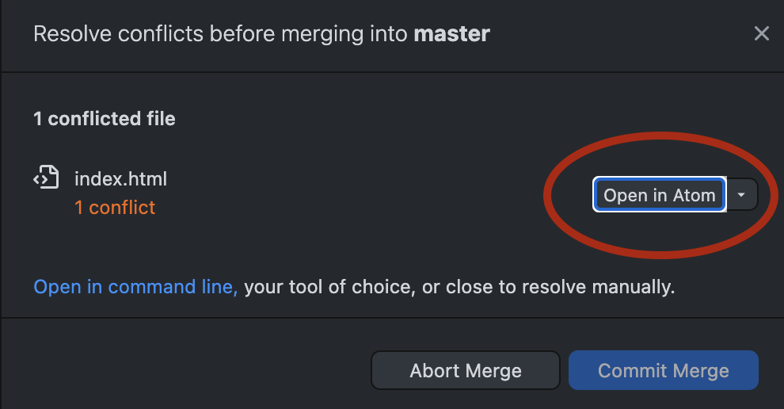
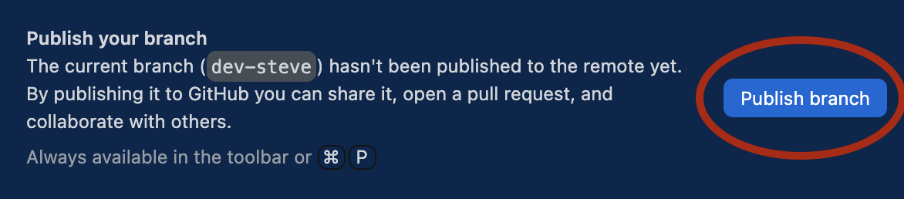
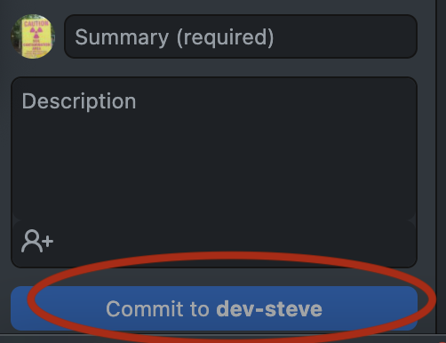
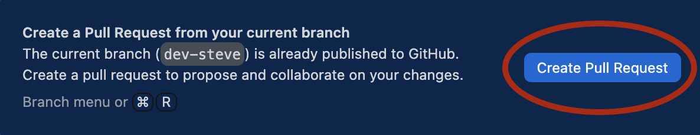

#IntraRepository Collaboration  

Use Git to clone repository content to your local computer to edit and manage files remotely.

**Bennefits of this method...**

* work remotely with others within the same repository
* set up project kanban boards to organize sprints
* choose to work privately or publicly
* set your own rules about committing and merging content

**Disadvantages**

* if team members don't use Git, they will overwrite files
* conflict may arise if workflow rules are not established

(note: you must be invited by the repository owner to become a collaborator)
1. Go to [ATTW GitHub Repository]() Click "Code" and then "Open with GitHub Desktop."
2. When prompted, click Clone to use Git to copy the repositories to a place on your local files .
3. Now open the index.html file using a code editor like atom.
4. Scroll through the code until you find the "**Project Section**"
5. Replace my project with your own idea.
6. Save your changes.
7. Return to GitHub desktop.

## Open Push Workflow - Commit to Master

Leave a comment detailing your edits and click "**commit**. Now you will must "**Push**" your changes to the repository. If there are conflicts, you will need be prompted to "**fetch**," "**pull**," and resolve editing conflicts before you can **commit** your changes.

  

## Dev Branch Workflow

Back in GitHub desktop, **create a development branch**.

Commit and push your changes to this branch.

Next, open a pull request and add a comment detailing changes for the merge master. If there are no conflicts or other problems, your merge master will "merge" your changes into the master branch.

Regardless of your method, you should periodically **fetch** the changes your teammates may have made to the repository and **pull** those changes to your local computer.

Peace and love, Stephen Quigley, University of Pittsburgh
